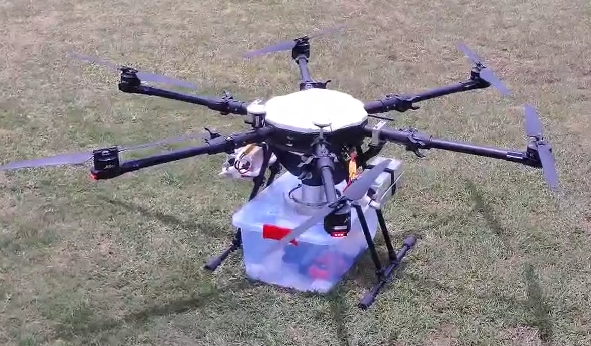
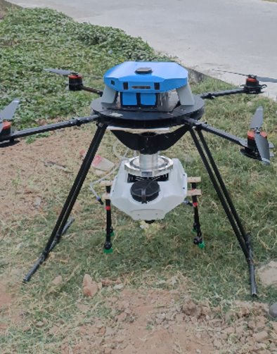
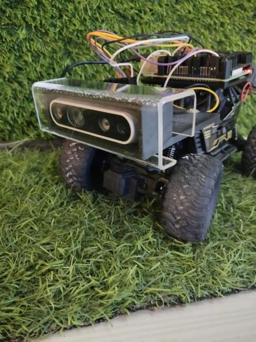
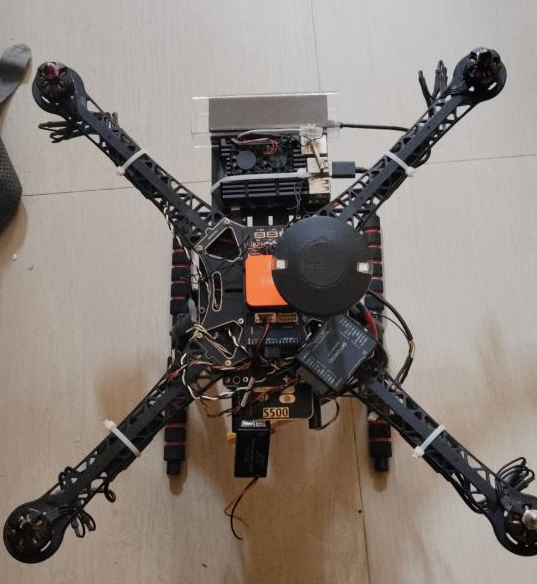

# 👋 Hi, I’m Keerthana Radhakrishnan  
Mechatronics Engineer | MSc Aerospace Engineering  
🚀 UAVs • Robotics • Autonomous Systems • Control Systems • Computer Vision • Ardupilot • PX4

I specialize in building intelligent robotic systems from concept to deployment — combining CAD design, control algorithms, embedded firmware, prototyping, and system integration.  

---

## 🚀 Featured Projects  

### 1. Agricultural UAV Systems (ArduPilot & PX4)  

<table style="border: none;">
<tr>
<td style="width:50%; vertical-align:center; padding-right:15px;">
- Developed and tuned PID control algorithms in simulation environments using MATLAB/Simulink, ArduPilot SITL and PX4-ROS Gazebo plugins.  
- Worked extensively with Mission Planner (ArduPilot) and QGroundControl (PX4) for mission planning, UAV calibration, and flight testing.  
- Led end-to-end system testing, including system architecture design, control logic implementation, real-time sensor data processing, and actuator response tuning.  
</td>
<td style="width:50%; text-align:center;">

</td>
</tr>
<tr>
<td style="width:50%; vertical-align:top; padding-right:15px;">
- Built and tested autonomous obstacle avoidance algorithms:  
    - Prototyped on a modified RC car platform for safe ground-based stereo-camera testing. Worked with OpenCV for real-time processing of stereo camera feeds.  
    - Successfully transitioned to UAV platforms for real-world deployment.  
- Designed and integrated a computer vision system using Intel RealSense D435 and OpenCV on Raspberry Pi, enabling depth-based obstacle detection and YOLO-based people detection from onboard RGB feeds.  
- Trained, validated and tested custom YOLO models for object detection and tracking for real-time monitoring from UAV.
</td>
<td style="width:50%; text-align:center;">

</td>
</tr>
</table>  

---

### 2. UAV Motor Thrust Testbed  

<table>
<tr>
<td style="width:60%; vertical-align:top; padding-right:15px;">
Designed & built a motor thrust testbed for evaluating UAV propulsion.  
- Integrated load cells, RPM, current/voltage sensors.  
- Firmware in C for data acquisition & control.  
- Web dashboard with **real-time graphing, logging, and motor control routines**.  
🔗 [Firmware on GitHub](https://github.com/REUDE-Technologies/REUDE_ROTRIX/tree/c2f114970714c9da11e9d43708735733df56fc4a/Firmware)  
</td>
<td style="width:40%; text-align:center;">

</td>
</tr>
</table>  

---

### 3. Custom Drone Firmware (ESP32)  

<table>
<tr>
<td style="width:60%; vertical-align:top; padding-right:15px;">
Developed customized drone firmware on the **ESP32 platform**.  
- Built from Espressif’s ESP-Drone (ESP-IDF + Crazyflie).  
- Integrated alternate IMU (LSM6DS0) for better performance.  
- Ensured stable flight control and accurate sensor interfacing.  
</td>
<td style="width:40%; text-align:center;">

</td>
</tr>
</table>  

---

### 4. Assistive Robotic Arm (Rehabilitation)  

<table>
<tr>
<td style="width:60%; vertical-align:top; padding-right:15px;">
Designed an **end-effector robotic arm** to support rehabilitation for motor-impaired patients.  
- Kinematics, dynamics & collision analysis in MATLAB/Simulink.  
- Firmware for inverse kinematics & real-time feedback control.  
- Mechanical structures designed in SolidWorks; fabricated via CNC & 3D-printing.  
*(Prototype visuals limited due to confidentiality.)*  
</td>
<td style="width:40%; text-align:center;">

</td>
</tr>
</table>  

---

### 5. Miniature Surgical Robots & Magnetic Control  

- Worked on **miniature microrobots** for minimally invasive surgery.  
- Developed a LabVIEW-based control system for a **9-axis magnetic device**.  
- Assisted in in-vitro experiments with real-time imaging & navigation.  

---

### 6. Master’s Thesis (NTU, Singapore)  

- Title: *Impact Study of Airborne Collision Between Drone & Commercial Aircraft at Low Altitudes*.  
- CAD-modeled aircraft engines & commercial drones in SolidWorks 2019.  
- Compared UAV collisions with bird strike data.  
- Performed failure mechanism analysis to assess safety implications.  

---

## 🛠 Skills & Tools  
**Programming:** C, C++, Python, MATLAB
**Platforms:** ROS2, ESP-IDF, PX4, ArduPilot, Embedded Linux  
**Tools:** SolidWorks, Simulink, LabVIEW, Git  
**Specialties:** UAV systems,  Electromechanical design, Embedded firmware, Control algorithms, Sensor Fusion, Vision systems 

---

## 📫 Get in Touch  
📧 [keerthanaradhakrishnan@outlook.com](mailto:keerthanaradhakrishnan@outlook.com)  
💼 [LinkedIn](https://www.linkedin.com/in/keerthanaradhakrishnan)  

